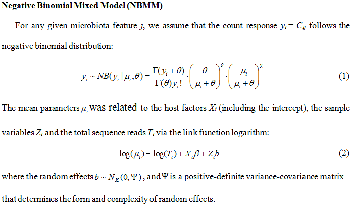

# BhGLM - NBMM (Negative Binomial Mixed Model)

## Introduction
Recent advances in next-generation sequencing (NGS) technology enable researchers to collect a large volume of metagenomic sequencing data. These data provide valuable resources for investigating interactions between the microbiome and host environmental/clinical factors. In addition to the well-known properties of microbiome count measurements, for example, varied total sequence reads across samples, over-dispersion and zero-inflation, microbiome studies usually collect samples with hierarchical structures, which introduce correlation among the samples and thus further complicate the analysis and interpretation of microbiome count data. We propose negative binomial mixed models (NBMMs) for detecting the association between the microbiome and host environmental/clinical factors for correlated microbiome count data. The proposed mixed-effects models incorporate random effects into the commonly used fixed-effects negative binomial model to account for correlation among the samples. 

The details of the statistical model are as follows:



## Installation
You can install our BhGLM package by downloading BhGLM_1.1.0.zip
```r
install.packages("./BhGLM")
library(BhGLM)
```

## Usage
```r
glmm(ixed, random, data, family, correlation, weights, control)
```
## Arguments

- **fixed, random, data, correlation, weights, control**: These arguments are the same as in lme from R package 'nlme'.  	   
- **family**: For negative Binomial Mixed Model, the value is "nb'. 

## Examples

```r
library(BhGLM)

# parameter settings
  n = 200       # 400, 200
  n.dam = 20    # 40, 20
  b0 = c(0.4, 0.55)
  cor = c(0.5, 0.8)

# data simulation
  corr = runif(1, cor[1], cor[2])
  x = sim.x(n = n, m = 2, corr = corr)
  q = rep(1/n.dam, n.dam-1)
  q = cumsum(q)
  quantiles = quantile(x[,1], q)
  dam = as.numeric( factor(cut(x[,1], breaks = c(-Inf, quantiles, Inf))) )   
  quantiles = quantile(x[,2], 0.45)
  diet = as.numeric( factor(cut(x[,2], breaks = c(-Inf, quantiles, Inf))) )
  diet = diet - 1   
  
  da = rep(NA, n.dam)
  sigma = runif(1, 0.5, 1)
  for (j in 1:n.dam) da[j] = rnorm(1, 0, sigma)
  mu0 = runif(n, 0.1, 3.5)
  theta = runif(1, 0.1, 5) 
  b = runif(1, b0[1], b0[2]) 
  ys = sim.y(x = diet, mu = mu0 + da[dam], sigma = 1, coefs = b, p.neg = 0, nb.theta = theta) 
  y0 = ys$y.nb
  N = exp(mu0)

# model fitting and summary
  f = glmm(y0 ~ offset(log(N)) + diet, random = ~ 1 | dam, family = "nb", verbose = F) 
  out = summary(f)
  out
```

## Contact
Feel free to contact me by nyi AT uab.edu
